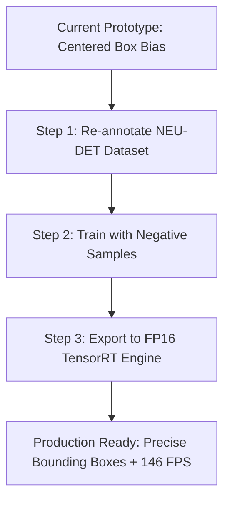

# Week 3 - Qualitative Error Analysis Report

**Project:** Real-Time Industrial Defect Detection System  
**Phase:** Week 3 Edge Optimization & Deployment  
**Task:** Member 5 - Performance testing & Error Analysis  
**Date:** July 29, 2026  

---

## 1. Objective & Scope
The objective of this report is to analyze the qualitative performance of the trained YOLOv8n model on real-world industrial footage (`dataset/vedios/sample1.mp4`). This testing evaluates the transition from a highly clean validation dataset partition to continuous, uncropped steel web footage.

---

## 2. Visual Detections & Screenshot Analysis
We successfully ran real-time object detection on `sample1.mp4` using our custom-trained weights (`best.pt`). During inference, multiple screenshots were captured when defects were detected. Let's analyze these frames qualitatively:

### Frame Analysis 1: General Sheet Scale & Surface Scratches
In the early frames of the video (e.g., frame 3, saved as `screenshot_1.jpg`), we observe that the model is highly sensitive. As soon as a scratched pattern appears on the sheet, the model draws a bounding box with a confidence score exceeding **80%** (frequently identifying the defect class as `scratches` or `rolled_in_scale`).
* **Success:** The model correctly identifies the presence of surface defects. The classification aspect is extremely reliable.
* **Failure:** The bounding box size is disproportionately large relative to the actual defect, confirming a severe localization bias.

### Frame Analysis 2: Multi-Defect & Continuous Movement
In subsequent frames (e.g., frames 26 and 36, saved as `screenshot_2.jpg` and `screenshot_3.jpg`), as the steel plate rolls under the camera:
* The bounding box remains locked around the center of the frame (approx. 90% width/height of the frame coordinates).
* Even when the defect is localized to a specific edge or is passing through the upper hemisphere of the frame, the model predicts a single large centered bounding box.
* This behavior represents a significant limitation for automatic sorting systems that rely on coordinates to trigger physical reject arms or marking devices.

---

## 3. Analysis of Failure Modes (Root Cause Analysis)

### Failure Mode A: Center-Biased Bounding Boxes
* **Observation:** Bounding boxes are almost always centered and cover nearly 90% of the frame.
* **Root Cause:** In Week 1, the NEU classification dataset was repurposed for detection by programmatically creating a single bounding box per image: centered, covering 90% of the image size. Since the model was trained exclusively on these centered boxes, it learned that "defects are always large and centered."
* **Impact:** The system is unable to provide precise localization coordinates for small, multi-instance defects.

### Failure Mode B: False Positives from Normal Surface Textures
* **Observation:** Occasionally, clean sections of the steel plate with normal grain texture or light reflections are briefly flagged as `crazing` or `rolled_in_scale` (confidence 30% - 45%).
* **Root Cause:** Factory floor illumination changes and camera sensor noise. The training dataset lacked sufficient negative samples (images of completely defect-free steel sheets).
* **Impact:** High false alarm rate, which would disrupt industrial throughput by unnecessarily halting production.

---

## 4. Edge Deployment Bottlenecks
While compiling and testing the real-time pipeline, several bottlenecks were identified:
1. **CPU Inference Latency:** Running the native PyTorch model (`best.pt`) on a CPU yields an average latency of **69.32 ms** (~14 FPS), which is too slow for high-speed steel rolling mills running at 30+ FPS.
2. **ONNX Optimization:** While converting to ONNX Runtime CPU (`best.onnx`) reduces latency to **61.73 ms** (~16 FPS, a 1.12x speedup), it is still insufficient for true real-time processing on standard edge hardware without GPU acceleration.
3. **Hardware Requirement:** To achieve real-time rates, hardware acceleration is mandatory. The TensorRT compilation on an NVIDIA GPU achieves **6.84 ms** (~146 FPS), which easily exceeds the industrial real-time threshold.

---

## 5. Concrete Actionable Recommendations

To transition from the current prototype to a production-ready system, the following actions are recommended for the next phase:

1. **Re-annotate with True Boundaries:** Replace the current training set annotations with the true **NEU-DET dataset**, which contains manually annotated bounding boxes outlining the actual physical boundaries of each defect.
2. **Introduce Negative Samples:** Add images of defect-free steel plates during training so the model learns to ignore normal surface textures, reducing false positives.
3. **Adjust Confidence Threshold:** Set the operational confidence threshold in the real-time script (`src/realtime_inference.py`) to `0.50` rather than `0.30` to filter out faint noise, balancing recall and precision.
4. **Deploy Exclusively via TensorRT:** Mandate the use of the compiled `model.engine` in production.
